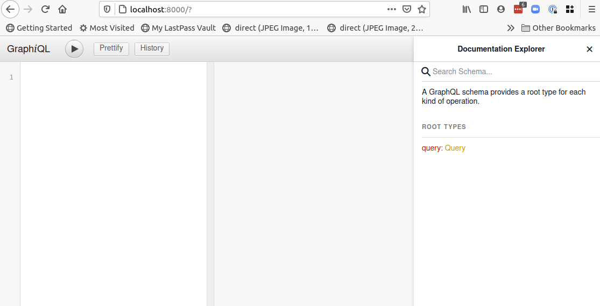
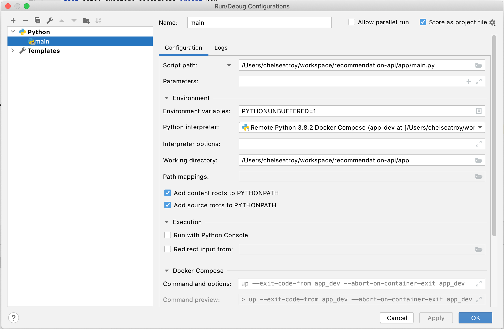
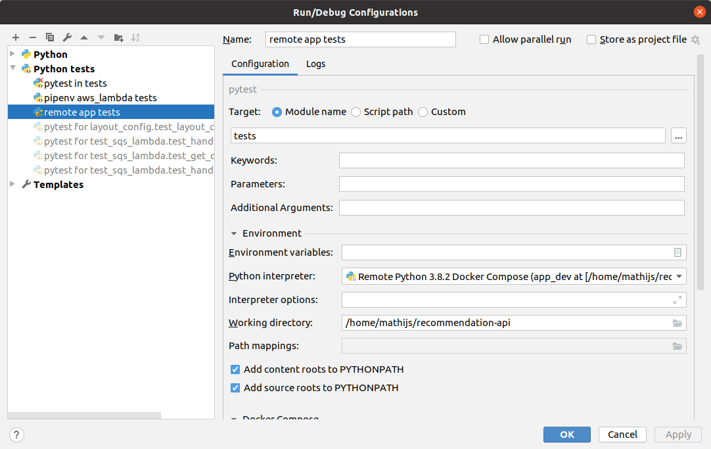

# Local Development

## Basic setup
The following basic setup allows you to run the app locally in a Docker container.

1. Install the following tools:
    - docker
    - docker-compose (comes pre-installed on Mac OS)
    - pip
    - pipenv
    - An IDE (we like PyCharm)

2. Create a `.env` file in the project root:
    ```
    SENTRY_DSN=<local Sentry DSN>
    ```
3. Run `docker-compose build && docker-compose up` to start the Docker container. 
It's expected that a lot of messages will be printed. When it is ready and you visit http://localhost:8000, it should look similar to below.
You will see:
    - a panel (left) where you can enter a query. See [README.md](/README.md) for examples.
    - a panel (center) where results of queries will appear when you write a query and click the "play" button on the top bar.
    - a panel (right) for clicking around to explore our GraphQL query model.




1. This is an API on the GraphQL protocol. When you visit localhost:8000, you will have:

## Adding Python dependencies using Pipenv
Run `pipenv install <package>` to add a package to Pipfile and Pipfile.lock,
and to install it to the environment. Add `--dev` if the package is not needed in production.

### Error: "libraries mkl_rt not found" on Big Sur
At the time of writing, SciPy, pip, and BigSur aren't compatible. This will likely be solved
by an update in pip and/or SciPy in the near future. Until then:

- Ask someone on Linux (Mathijs) or macOS Catalina (Chelsea) to add dependencies to Pipfile.
- Untested alternative:
   - Start a generic Python docker container.
       ```
       version: "3.9"
   
       services:
         dev:
           image: python:3.8
       ```
   - Run `apt-get install pipenv`
   - Run `pipenv install <package>` in the Docker container.

## Debugging the app in PyCharm 
1. Complete the 'Basic setup' above.
2. Follow the steps to
[configure an interpreter using Docker-Compose](https://getpocket.atlassian.net/wiki/spaces/PE/pages/1956937762/PyCharm+Interpreter+Setup#Docker-Compose)
on Confluence.
    - Set 'Service' to 'app_dev' when adding the interpreter.
3. Click Run > Edit configurations.
4. Add a Python configuration using the + icon in the top-left. (See screenshot below.)
    - Set 'Script path' to `<project root path>/app/main.py`.
    - Set the Python interpreter to the Remote Python interpreter created in step 2.
    - Set 'Working directory' to `<project root path>/app/`.
5. To test your setup, set a breakpoint in app/main.py in the healthcheck, and visit http://localhost/health-check.



## Running/debugging app tests in PyCharm
Follow steps 1-2 from the above section 'Debugging the app in PyCharm', to add a Docker-Compose interpreter.

With the remote interpreter selected as the project default, there are many ways in PyCharm to run tests:
- Right click on the test directory and choose 'Run pytest in tests'.
- Click the play icon next to individual tests or test classes.
- Add a pytest run configuration: (See screenshot below.)
    1. Click Run > Edit configurations.
    2. Add a pytest configuration by clicking the + icon and choose Python tests > pytest.
        - Set 'Module name' to "tests".
        - Set the 'Python interpreter' to the Remote interpreter.
        - Set the working directory to the project root.



## Running/debugging aws_lambda tests
Create a Pipenv virtual environment:
1. `cd aws_lambda`
2. `pipenv install --dev`

Repeat the above steps any time git pulls in changes to aws_lambda/Pipfile.lock.

PyCharm can only add Pipenv files located in the project root. Use the following work-around to add a Pipenv interpreter using the Pipfile located in aws_lambda/.

1. Choose File > Open, and open recommandation-api/aws_lambda in a new PyCharm project.
2. Open PyCharm > Preferences > Project: aws_lambda > Python Interpreter.
3. Click the cog in the top-right, and choose 'add interpreter'.
4. Choose 'PipEnv', and click 'OK'.
5. Close the aws_lambda PyCharm project.

Now use the aws_lambda Pipenv interpreter in the recommendation-api PyCharm project: 

1. Open PyCharm > Preferences > Project > Python Interpreter.
2. Click the cog in the top-right, and choose 'Show all'.
3. Select "Pipenv (aws_lambda)", to make this the project default.
4. Wait until PyCharm finishes indexing files.
5. Add a pytest run configuration: (See screenshot below.)
    1. Click Run > Edit configurations.
    2. Add a pytest configuration by clicking the + icon and choose Python tests > pytest.
        - Set 'Module name' to "aws_lambda.tests".
        - Set the 'Python interpreter' to the Pipenv (aws_lambda) interpreter.
        - Set the working directory to `<project root path>/aws_lambda`.


### Error: You must specify a region
The tests pass reliably in CircleCI, but we currently don't have a local Docker environment
to run them in, which makes them less reliably locally. We've seen the following error locally:
```
botocore.exceptions.NoRegionError: You must specify a region.
```
If you see this, don't hesitate to ask for help in #team-backend. We could set up a simple
Python docker container to isolate the tests from the host environment, which is how we run them in
.circleci/config.yml.
